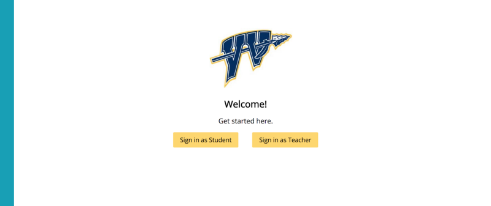

As a computer science student at Berkeley without prior development experience, it was easy to get lost in my academics and be unaware of what skills were valued in industry. My sophomore year, I wanted to work on building these industry skills, so I joined [CodeBase](https://codebase.berkeley.edu/) in Spring 2018. I spent the semester learning new skills and contributing to the development of a mobile application for [Propel(x)](https://www.propelx.com/), a San Francisco startup that matches investors to startups.

Being a Client developer in CodeBase, I was challenged to grow my technical skills quickly. However, I thought it would have been so helpful to have a stronger foundation in web development going into the club. This Fall, I wanted to step up and make sure that incoming members had the proper resources to truly succeed on Client projects.

As a result, I decided to co-lead the Mentored Project, a project unique to CodeBase that teaches web development to incoming members who have little to no background in computer science.

### **Planning the Curriculum**

During the planning process, [Bradley Chee](https://www.linkedin.com/in/bradleychee/) and I structured the Mentored Project curriculum in a way that ensured students graduating out of the project would truly understand full-stack web development.

I am a fan of project-based learning, for the best way to learn to code is to simply… code. This pedagogical philosophy guided the curriculum development process.

In previous semesters, the Mentored Project involved building internal tools for Codebase. However, in order to truly reflect our organization’s industry focus, we wanted to restructure the curriculum to include an external client. We planned a curriculum that involved members individually coding a series of mini-projects to learn full-stack fundamentals, along with working together to create a large lesson management tool for the teachers of [Ygnacio Valley High School](https://yvhs.mdusd.org/).

### Low-Floor, High-Ceiling

When creating curriculum, I like to follow the philosophy of [low floor, high ceiling](https://news.stanford.edu/2015/04/17/math-week-boaler-041715/). This means that curriculum is easy to approach, but any student can take it to any level. This allows students to have more ownership over their project and be really proud of the unique product that they build.

### **The Curriculum in Practice: Mini-Projects**

The web is rooted in JavaScript, but most of the developers came into the Mentored Project having no experience with it. Thus, in week 1 of the Mentored Project, members built an interactive visualization that uses [p5.js](https://p5js.org/), a JavaScript library for visual interactions. One of our students build a bubble sort visualization!

*Carolyn Duan’s Interactive Bubble Sort Visualization: [https://duancaro.github.io/p5/empty-example/](https://duancaro.github.io/p5/empty-example/)*

After this introductory project, it was time to truly delve into web development. In the next two weeks, members learned [React](https://reactjs.org/) and how to style different components of a website. Here are some examples of their personal websites!

*Richard Liu’s Personal Website:* [https://richardliu.me/](https://richardliu.me/)

*Kelvin Jue’s Personal Website:* [https://kelvinjue.github.io/](https://kelvinjue.github.io/)

After creating beautiful websites, it was time to move onto backend (the part of web applications that deals with all the data). Members learned the [Express.js](https://expressjs.com/) framework to create API endpoints and [Postgres](https://www.postgresql.org/) to create a working database to interact with the API. One of our students used the anime API to create this [page](https://juliaxwang.me/studio-ghibli/) on various anime. 

### **The Big Project**

In Codebase, we learn by doing. As the developers were learning these newfound skills of web development through their mini projects, they also worked together throughout the semester to build a lesson management tool for the teachers of Ygnacio Valley High School.

Through learning full stack web development, the Mentored Project created a web application that allowed to teachers to login, view and create classes, add units for those classes, upload lessons for those units, and track student feedback data on those units over multiple years.

Here are some screenshots of what the application looks like right now!

These screenshots just show the work but don't really describe the process. Coding this project involved several all nighters in various apartments and libraries. Through this process, these students became amazing friends. Some would knock my apartment door at 2 am and I would cook them waffles and help with a bug.

### **Conclusion**

My favorite experience in college was watching these members come into the Mentored Project with limited computer science knowledge and work hard to build the necessary industry skills in software development. Through the various all nighters and endless bugs, they persisted. Most importantly, I'm proud of the community that developed as a result of this learning process. These students remain some of my closest friends and have become leaders in the UC Berkeley software engineering community. Two of them now lead the Mentored Project!

