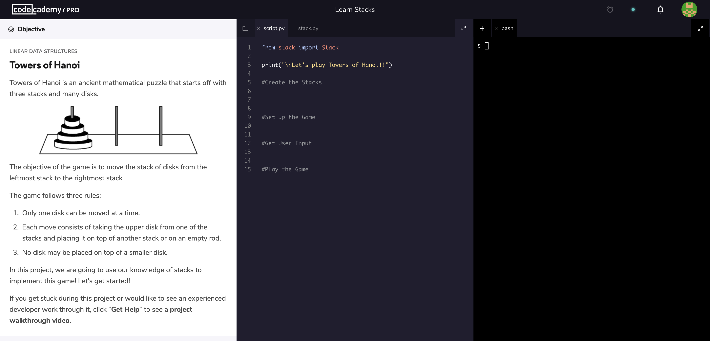
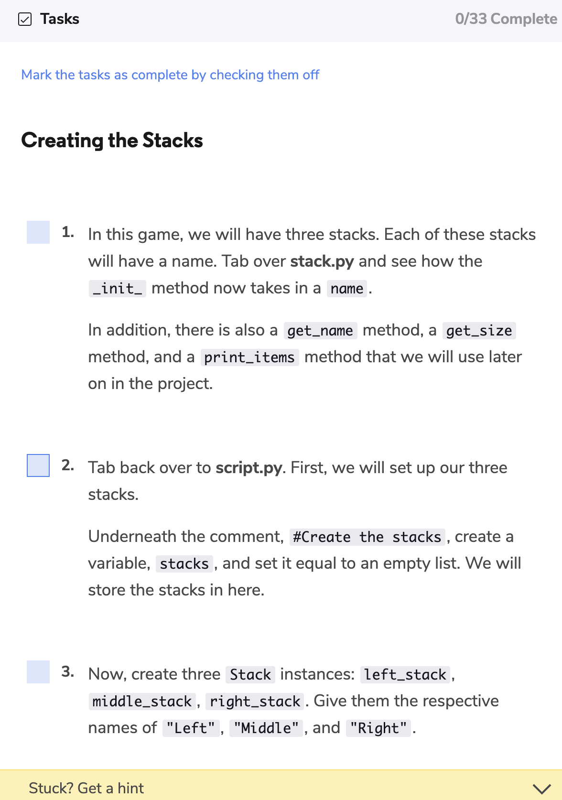

In June 2018, I left the public school classroom and went to New York City to develop computer science curriculum for Codecademy for 6 months.

I was really nervous about entering this experience. I had to develop curriculum for students I didn't know. I didn't get to use a physical classroom to my knowledge. My approach to curriculum had to be a lot different.

The following is my approach to developing curriculum for various data structures and algorithms modules at Codecademy.

### Teaching with Restrictions

When I first arrived at Codecademy, I was filled with ideas and awesome projects our learners could do, but I quickly came to realize one of the key constraints of platform based education:

> You can only teach what you can assess through scale.

Assessment is key in any curriculum development process, but on educational technology platforms like Codecademy, there are lot more restrictions than an in person classroom.

I could no longer do crazy, open ended projects because I wouldn't be able to adequately and automatically assess millions of learners through that pedagogy.  

However, I still wanted to bring my passion of fun and project based learning to the platform. One of the ways I did this was by having learners create games. I developed a `stacks` project that walked students through creating an in terminal Towers of Hanoi game. 

On online platforms, I realized that my curriculum needed to be more assistive. I couldn't just leave the student on their own because that could be discouraging to a student and they could possibly leave learning computer science. In the below picture, you'll see just a few of the 33 steps I guided students through completing the project.

I won't lie. This isn't my favorite type of teaching because of how assistive it is. I would rather have the students work to figure it out on their own and be there if they really need help, but on a platform that holds over 45 million learners, that's close to impossible. 

### Playing with Different Mediums

I was one of the first people at Codecademy that added video based learning to the platform! I was really proud of this.

Video based learning is important when you asynchronously teaching a tough technical concept. At Codecademy, I had to teach Dijkstra's and A* algorithm. I couldn't exactly do that through simple diagrams and text. I really needed to visually walk students through an example as a part of my lesson. Setting up each video and rehearsing took a lot more time than expected. I gained a new level of respect for Sal Khan. 

Here's my [video](./A_SearchConceptual.mp4) for A* algorithm (sorry for my mildly croaky voice, I did this video at 3 am 😴)

### Reflection

I really enjoyed my time at Codecademy and it definitely solidified by path into computer science education. Above are just two samples of the work I did. At Codecademy, I developed:

- A project for stacks
- A conceptual and python module on asymptotic notation
- A conceptual and python module on binary search
- A project on linear search algorithms
- A conceptual and python module on Dijkstra's Algorithm
- A conceptual and python module on A* Algorithm