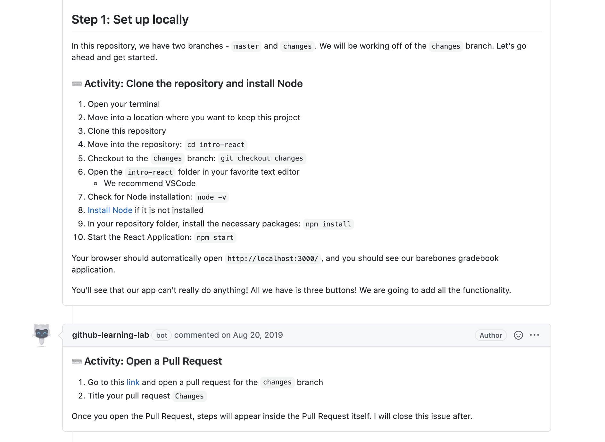
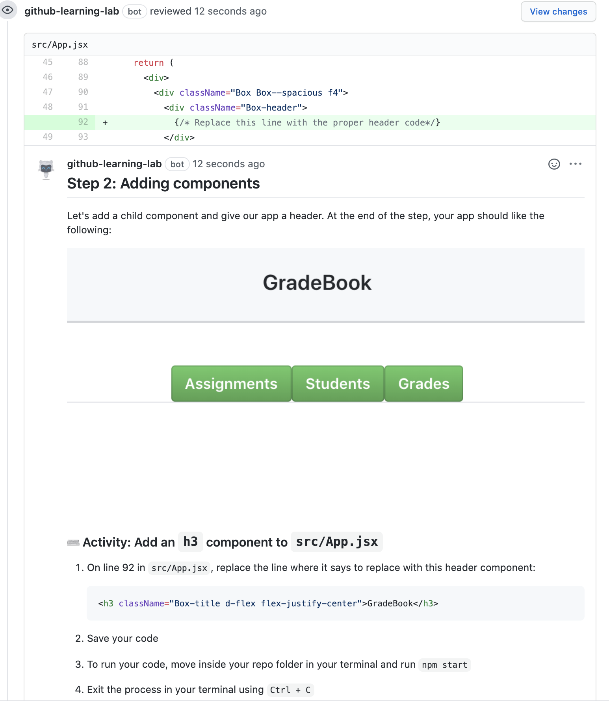

As a teacher, it is important that I also highlight curriculum that I've really struggled to develop.

After I left Codecademy, I joined GitHub as the first person hired to be dedicated completely to course creation on their new learning platform, [GitHub Learning Lab](https://lab.github.com/).  I thought this job would be easy after my experience at Codecademy, but that was not the case.

I was tasked with creating a `React.js` course on the Learning Lab platform. The way courses work as GitHub is very interesting. Learners submit pull requests to code that the course told them to write. The course then uses web hooks to give back feedback on the code and further instructions.

### The Struggle of Assessing Code

At Codecademy, I was able to write tests that ran the students' code which allowed me to provide feedback. However, at GitHub, I no longer was able to do that. I had access to the file so I had to do string matching to determine if code was in the right place. This proved to be extremely annoying. I ended up writing instructions like this:

### Project Based Learning

While there were many struggles in developing curriculum like this, I was excited about about a couple things:

- Students properly learned GitHub through the course
- Students walked away with a project

It's important that students have something to show off, and this course did a good job at that. Students had a repository filled with project code. I also gave students follow up instructions on how to deploy their project. GitHub wrote a blog about my project [here](https://github.blog/2019-08-21-github-intern-project-building-courses-on-full-stack-development/?utm_campaign=1566335522&utm_medium=social&utm_source=twitter&utm_content=1566335522).

### Realizing my Passion

It feels weird to say this, but GitHub made me realize that I couldn't develop curriculum for students I didn't know. I wasn't satisfied developing curriculum for platform based education. For my next job, I wanted to make sure I was joining a school where I could get to know the students and where I could develop curriculum with fewer restrictions.