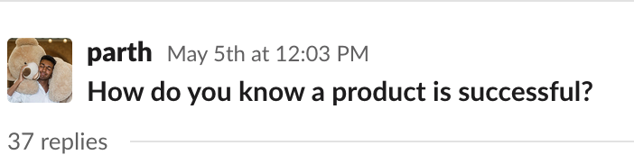
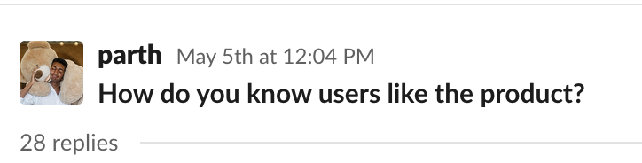
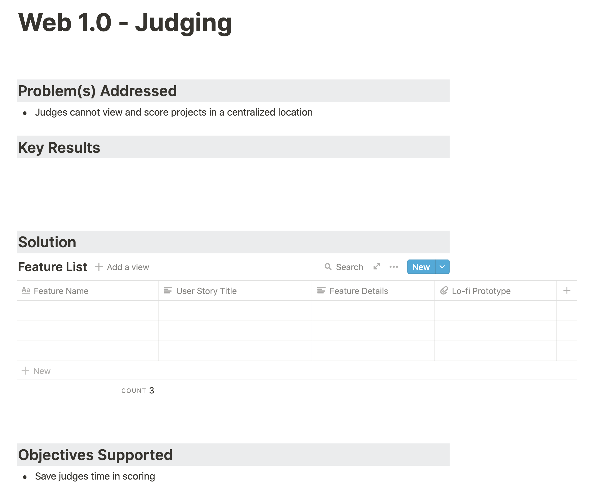
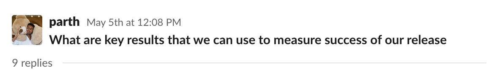
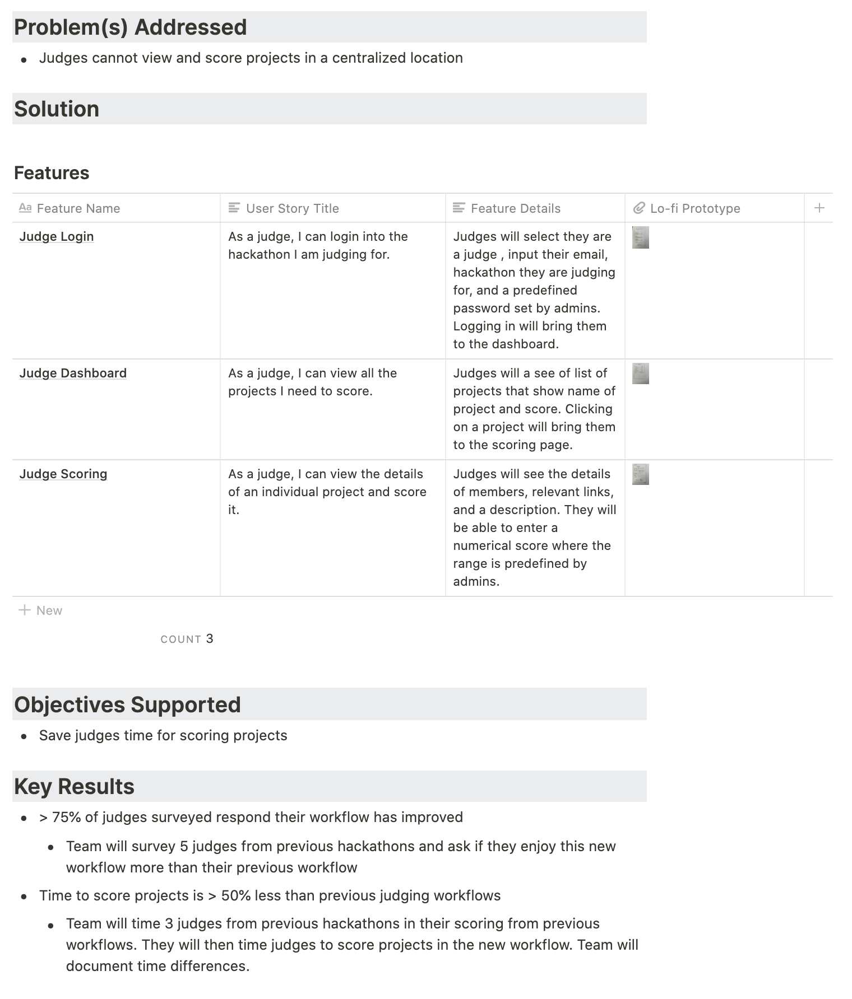
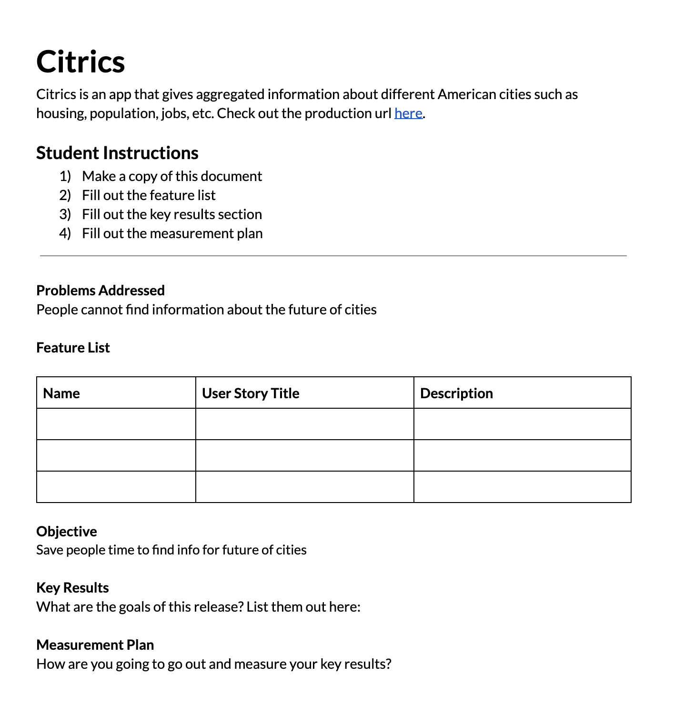
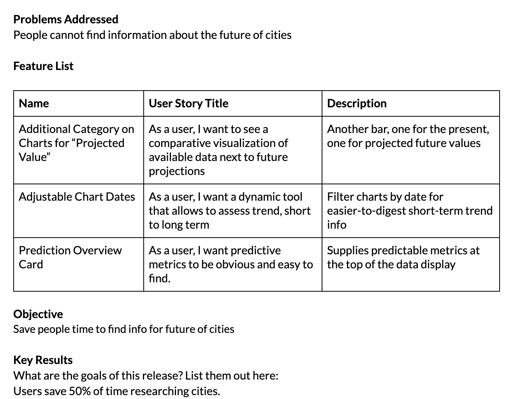

I'm currently an Experiential Learning Manager at Lambda School, where I get to teach students product development by having students work in teams to deliver a product to a client. During this process, I teach students how to properly write a product release canvas. Below is my lesson plan and reflection.

### Understanding key results

I start out the lesson by asking:

Students generally responded with things such as:

- "Users like it"
- "Positive engagement"
- "People keep coming back"

I then asked:

Students generally responded with things such as:

- "Surveys"
- "Ratings, Reviews, Tracking"
- "Metrics"

Awesome! At this point, students understood they needed quantitative metrics on their product. Next, I needed students to figure out what quantitative metrics were important to track.

### Working on a product as a class

In order to do this, I decided to create key results for a fake product in front of the class. The fake product was Hackathon Portal. This was the following problem:

> Hackathon judging is an issue at every hackathon. This should be an application where coders can easily submit their hackathon projects (video submission, deployed link, github url), judges can easily score projects, and organizers can organize the process by creating project categories, a rubric, and assigning judges to projects.

In order to create a release, we focused on one user problem - the judges. Here is the template for that release:

With the objective to "Save judges time in scoring", I asked the class:

This is where students struggled. One student said, "Judges are able to look for projects in one place." However, this doesn't exactly map back to our objective. After re emphasizing the objective, students finally said, "Time to score a project."

I then brainstormed with the class what features we should build, and we came up with the following release:

### The students' turn

After creating a product release together, it was time for students to do it. I used the zoom breakout room feature, and student groups fill out the blank sections of the following release:

Students produced some awesome work. Here's an example of one:

After students created their releases, I live critiqued a couple of their release canvases. After this lesson, students then went back into their project groups and wrote releases for the large projects they were to complete by the end of the curriculum.

### Reflection

What I loved about this lesson was the level of collaboration, despite it being a remote classroom. In just one hour:

- I created a release with the hep of students
- Students created a release in groups

As a result of this lesson, we saw an improvement in the quality of release canvases that students created for their large projects!