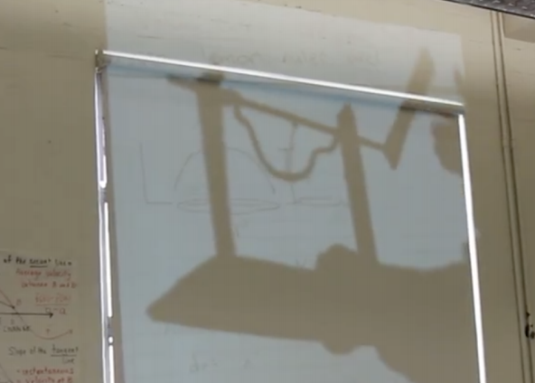
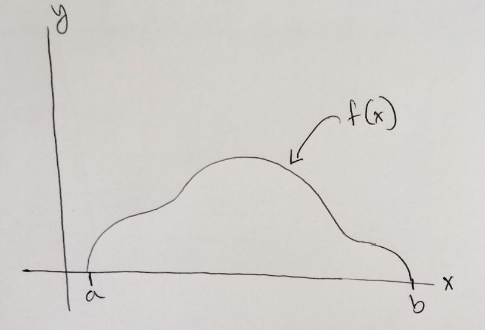
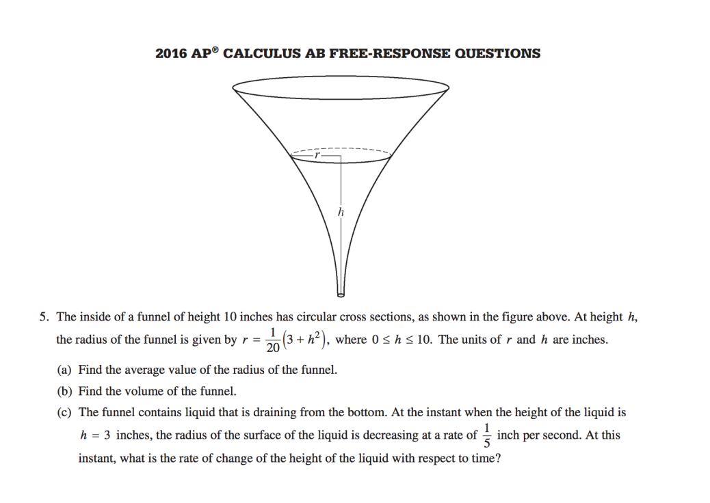

Calculus was my favorite subject in high school, and it's what inspired me to pursue education as a career. I didn't care about its applications to economics or machine learning. I just loved the visualizations and being able to play with math.

When I was a student teacher in an AP Calculus classroom at Berkeley High School, I wanted to bring fun experimentation to the classroom. In this lesson, rather than tell students the disk method formula, I had students discover it themselves through visual experimentation. 

### Discovery

At the beginning of class, I gave each group a lemon, a knife, and a ruler. There task was simple:

> Find the best estimate of the volume of the lemon.

The various approaches that students took were fascinating! Some students started by peeling the lemon and calculating the surface area of the peel. Many students began cutting the lemon into disks and summing the volume of each cylinder. I didn't ask for any documentation, but here is an example of a group that went above and beyond:

### Engaging Epiphanies

After students calculated the volume estimates and shared their various approaches, I wanted to bring the calculus to it. Again, I love visualizations, so I built a little contraption that show cased what rotating lemon graph would look like. The first picture is my initial sketch, and my second is what I actually showed students. Not bad right?

I used my projector skills and rotated the graph to show how the rotating graph encompasses the volume. 

Given that students summed up disks to estimate the volume and how the rotating graph could give the exact volume, could we come up with a mathematical expression that could give us the volume?

Students began to have this epiphany. I made the careful decision to not show them what the disk method formula was. Instead I asked:

> If the graph of the lemon is f(x) and it stretches on the interval (a, b), in groups, write an expression that evaluates to the exact volume of the lemon

The methods that students came up with were amazing. One of the groups even used multivariable calculus to showcase the volume:

$\int_{0}^{2\pi} \int_{a}^{b} f(x)  dx d\theta$

This is technically not wrong, and it's extremely impressive that students went to math beyond the scope of the class to solve the problem. Most groups arrived at the more commonly known disk formula:

 $$\int_{a}^{b} \pi*f(x)^2  dx$$

After students discovered the formula, I once again went over it as a whole class.

### Assessment

Those who know me, know I hate tests. However, as an AP teacher, I do need to prepare them for the AP Calculus test. At the end of the class, I gave each group the following past AP exam problem and told them to complete 5b.

Every single group got the right answer! I wonder if there are better, more fun ways I could assess this.

### Reflection

What I loved most about this lesson was the accessibility. Students are often frightened by math, but frame in something as simple as "Find the volume of this lemon" allows students to pursue their own path of visual discovery. Students won't forget a formula they had to discover themselves. I'm proud to say that this lesson won me the 2018 National Student Teacher of the Year. Feel free to read my full research paper here