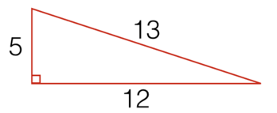
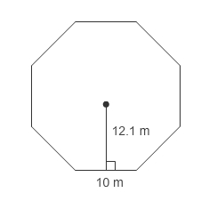
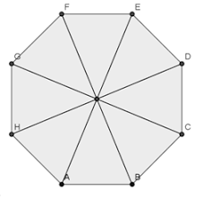
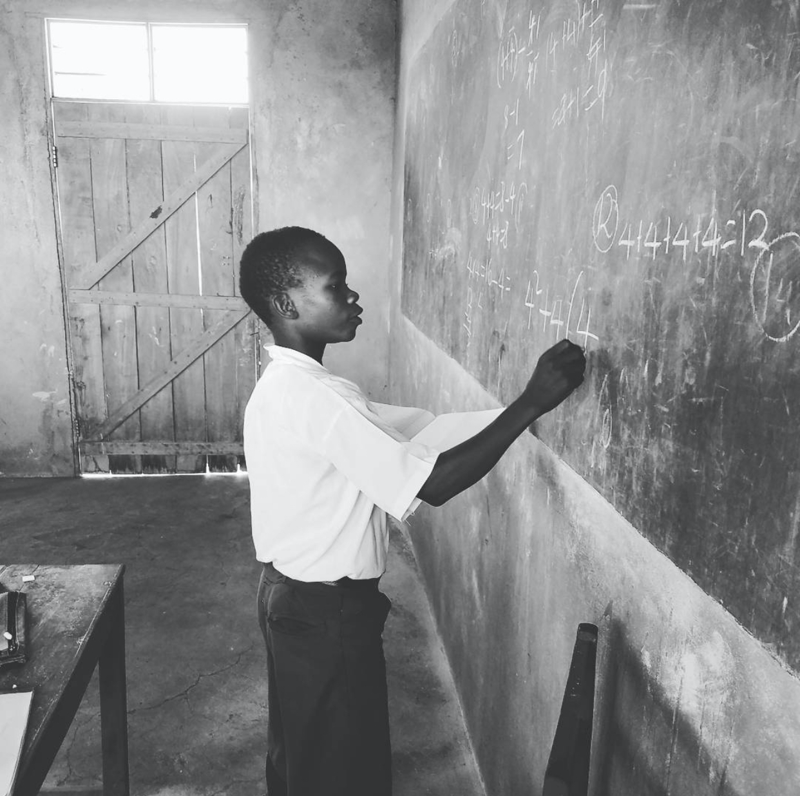

In summer 2017, I volunteered with [Reach Shirati](https://www.reachshirati.org/education) and went to rural Tanzania to teach middle school math. Watching the sunset over Lake Victoria is one of my favorite memories.

I'm not exactly a traditional math teacher. Problems where there are only one right answer are problems I don't like to explore. Unfortunately, this rigid and formulaic style of math is what the students seemed used to.

For instance, if I put the following triangle on the board and asked for the area, every single one of the students would be able to get it. They understood that the area of a triangle was the length of the base multiplied by the length of the height divided by two.

However, if I asked for them to find the area of the following octagon, they couldn't.

They weren't able to see the problem in a different way - that the octagon was just 8 triangles.

Even when I divided the triangles for them, they weren't able to see triangles in this new way. I clearly had my work cut out for me.

I wanted students to value multiple approaches, so my first lesson was four 4's. I asked students to do the following in groups:

> Create 20 expressions that respectively evaluated to the numbers 1 - 20 using exactly four 4's and any set of operations.

For instance, to create the number "9", you could do "4+4+(4/4)". This was no longer plugging and chugging formulas. I wanted to students to get creative with math, and this was a simple way to do it.

The results were fascinating. They were great at doing quick math through multiplication, division, exponents, etc., but they really struggled coming up with these expressions. Groups would cheer when they figured one out! 

I thought this lesson would only take maybe half an hour, but it ended up taking 2 hours stretched over 2 days. At the end of the activity, students put their expressions up on the board. If a student had a different expression that evaluated to the same number, they also came up to the board. I wanted to students to value multiple solutions.

Although this wasn't the coolest lesson (it was just numbers), students had so much fun with it. I recommend this activity for 5th - 6th graders.